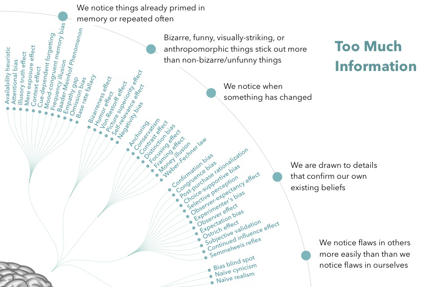
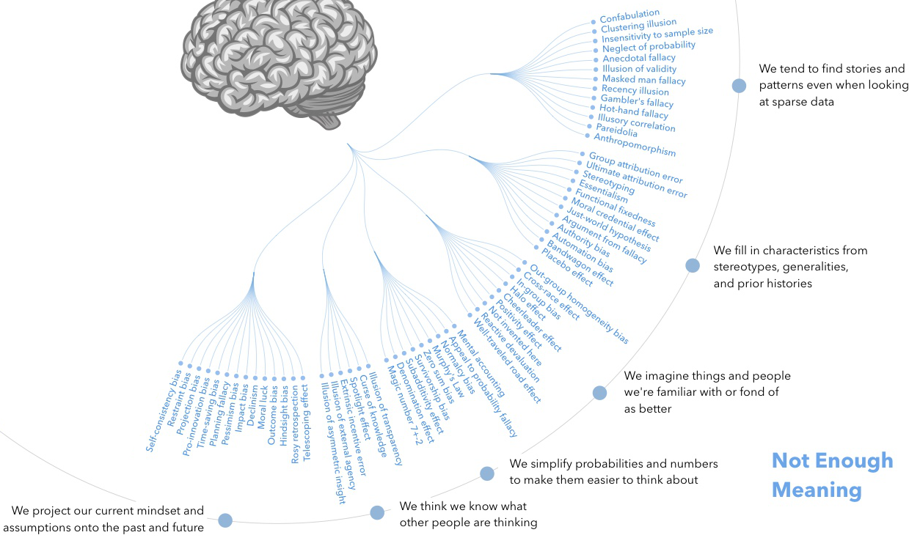
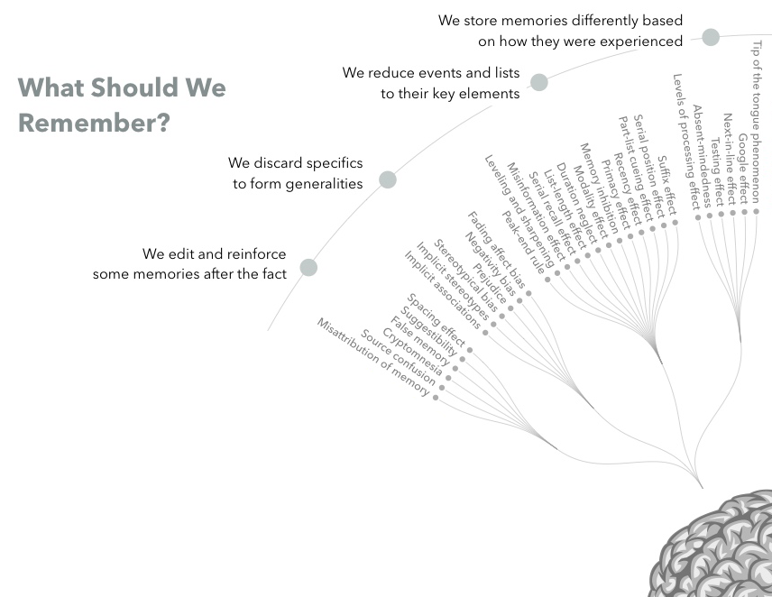
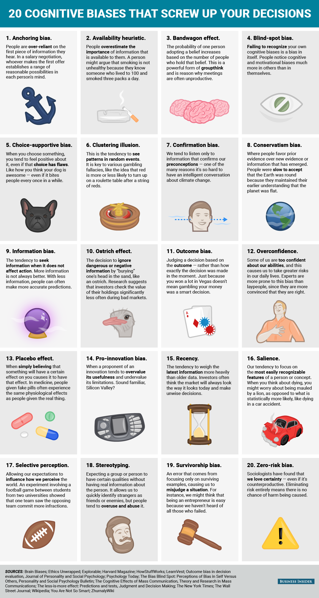

## Decision-making for teams
### How to overcome cognitive biases

by Tobias Käfer

Software Architect MyWebsite Infrastructure

Note:
Introduce yourself. XXX

---

<!-- .slide: class="img-overlay-heavy" data-background-image="images/tkaefer.jpg" -->

#### Tobias Käfer <!-- .element class="fragment fade-in" -->
##### since 11/2011 at 1&1 - MyWebsite Middleware as Senior Software Developer <!-- .element class="fragment fade-in" -->
##### since 12/2013 as Software Architect at MyWebsite Infrastructure<!-- .element class="fragment fade-in" -->
##### Involvement in team, department, division and company soft skill evolution (like MyWebsite Culture 2.0, Augenhöhe, Suns)<!-- .element class="fragment fade-in" -->
##### Cultural shaping attaché (in German "Kulturgestaltungsattachés") - Joachim Ritter<!-- .element class="fragment fade-in" -->

---

<!-- .slide: class="img-overlay-heavy" data-background-image="images/troy-mc-clure-1024x768.gif" -->

##### You might have seen me (not Troy McClure)<!-- .element class="fragment fade-in" -->
##### at my talk about imposter syndrome during PASK Conference 2017<!-- .element class="fragment fade-in" -->
##### at my previous talks on TECDay 2013, 2014, 2015, 2016<!-- .element class="fragment fade-in" -->
##### at "some" walls<!-- .element class="fragment fade-in" -->
##### involved in the Inside "Suns/Appreciate" project<!-- .element class="fragment fade-in" -->
##### at some 1&1 boards (Infrastructure, SOA, AC1)<!-- .element class="fragment fade-in" -->
##### anywhere around Docker, CaaS<!-- .element class="fragment fade-in" -->

---

## Cognitive Bias?

---

 <!-- .element style="height: 500px" -->

[source https://en.wikipedia.org/wiki/File:Cognitive_Bias_Codex_-_180%2B_biases,_designed_by_John_Manoogian_III_(jm3).jpg](http://bit.ly/CogBiasCodex) <!-- .element style="font-size: 0.4em;" -->

Note:
The notion of cognitive biases was introduced by Amos Tversky and Daniel Kahneman in 1972

---

### Feels like:
 <!-- .element style="height: 500px" -->

[source http://stdaily.ghost.io/knowledge-matters/](http://stdaily.ghost.io/knowledge-matters/) <!-- .element style="font-size: 0.4em;" -->

---

### Bias arises from various processes that are sometimes difficult to distinguish. These include

[source https://en.wikipedia.org/wiki/Cognitive_bias](https://en.wikipedia.org/wiki/Cognitive_bias) <!-- .element style="font-size: 0.4em;" -->

---

* information-processing shortcuts (heuristics)

---

* noisy information processing (distortions in the process of storage in and retrieval from memory)

---

* the brain's limited information processing capacity

---

* emotional and moral motivations

---

* social influence

---

### Biases can be distinguished on a number of dimensions. For example,

[source https://en.wikipedia.org/wiki/Cognitive_bias](https://en.wikipedia.org/wiki/Cognitive_bias) <!-- .element style="font-size: 0.4em;" -->

---

* there are biases specific to groups (such as the risky shift) as well as biases at the individual level.

---

* Some biases affect decision-making, where the desirability of options has to be considered (e.g., sunk costs fallacy).

---

* Others such as illusory correlation affect judgment of how likely something is, or of whether one thing is the cause of another.

---

* A distinctive class of biases affect memory, such as consistency bias (remembering one's past attitudes and behavior as more similar to one's present attitudes).

---

[source http://chainsawsuit.com/comic/2014/09/16/on-research/](http://chainsawsuit.com/comic/2014/09/16/on-research/) <!-- .element style="font-size: 0.4em;" -->

---

## Four problems that biases help us to address:

[source https://betterhumans.coach.me/cognitive-bias-cheat-sheet-55a472476b18](https://betterhumans.coach.me/cognitive-bias-cheat-sheet-55a472476b18) <!-- .element style="font-size: 0.4em;" -->

---

* Problem 1: Too much information.
* Problem 2: Not enough meaning.
* Problem 3: Need to act fast.
* Problem 4: What should we remember?

---

 <!-- .element style="height: 500px" -->

[source https://en.wikipedia.org/wiki/File:Cognitive_Bias_Codex_-_180%2B_biases,_designed_by_John_Manoogian_III_(jm3).jpg](http://bit.ly/CogBiasCodex) <!-- .element style="font-size: 0.4em;" -->

---

### Problem 1: Too much information.

 <!-- .element style="height: 500px" -->

----

#### We notice things that are already primed in memory or repeated often.

----

#### Bizarre/funny/visually-striking/anthropomorphic things stick out more than non-bizarre/unfunny things.

----

#### We notice when something has changed.

----

#### We are drawn to details that confirm our own existing beliefs.

----

#### We notice flaws in others more easily than flaws in ourselves.

---

### Problem 2: Not enough meaning.

 <!-- .element style="height: 500px" -->

----

#### We find stories and patterns even in sparse data.

----

#### We fill in characteristics from stereotypes, generalities and prior histories whenever there are new specific instances or gaps in information.

----

#### We imagine things and people we’re familiar with or fond of as better than things and people we aren’t familiar with or fond of.

----

#### We simplify probabilities and numbers to make them easier to think about.

----

#### We think we know what others are thinking.

----

#### We project our current mindset and assumptions onto the past and future.

---

### Problem 3: Need to act fast.

 <!-- .element style="height: 500px" -->

----

#### In order to act, we need to be confident in our ability to make an impact and to feel like what we do is important.

----

#### In order to stay focused, we favor the immediate, relatable thing in front of us over the delayed and distant.

----

#### In order to get anything done, we’re motivated to complete things that we’ve already invested time and energy in.

----

#### In order to avoid mistakes, we’re motivated to preserve our autonomy and status in a group and to avoid irreversible decisions.

----

#### We favor options that appear simple or that have more complete information over more complex, ambiguous options.

---

### Problem 4: What should we remember?

 <!-- .element style="height: 500px" -->

----

#### We edit and reinforce some memories after the fact.

----

#### We discard specifics to form generalities.

----

#### We reduce events and lists to their key elements.

----

#### We store memories differently based on how they were experienced.

---

## Great, how am I supposed to remember all of this?

----

### 1\. Information overload sucks, so we aggressively filter. Noise becomes signal.

----

### 2\. Lack of meaning is confusing, so we fill in the gaps. Signal becomes a story.

----

### 3\. Need to act fast lest we lose our chance, so we jump to conclusions. Stories become decisions.

----

### 4\. This isn’t getting easier, so we try to remember the important bits. Decisions inform our mental models of the world.

---

## Sounds pretty useful! So what’s the downside?

----

### 1\. We don’t see everything. Some of the information we filter out is actually useful and important.

----

### 2\. Our search for meaning can conjure illusions. We sometimes imagine details that were filled in by our assumptions and construct meaning and stories that aren’t really there.

----

### 3\. Quick decisions can be seriously flawed. Some of the quick reactions and decisions we jump to are unfair, self-serving and counter-productive.

----

### 4\. Our memory reinforces errors. Some of the stuff we remember for later just makes all of the above systems more biased and more damaging to our thought processes.

---

## But is this really that bad to be biased?

---

### How could we prevent biased decision-making in our daily work?

---

### Any ideas?

---

### So... really, how do I avoid of being biased?

---

### Nothing we do can make the 4 problems go away.

---

### Cognitive biases are just tools, useful in the right contexts, harmful in others.

---

### They’re the only tools we’ve got and they’re even pretty good at what they’re meant to do.

---

### You can't avoid being biased - You are biased.

---

### You need to deal with being biased.

---

### Be aware of your biases.

---

### Reflect yourself about your own biases.

---

### Try to understand which biases are driving the people around you.

---

### Be relaxed about the biases of others.

---

### Give others hints about their cognitiv biases.

---

### Talk about cognitive biases with your colleagues, friends, family etc. to find out what is driving them in their decisions.

---

### Cognitive biases are dynamic as the situations, discussions, decisions etc. are
-
### people could change strategies and minds, so biases are not static, but centextual.

---

### What are your biases?

-

### What are mine?

---

So... Questions?
 <!-- .element style="height: 500px" -->

[source http://stdaily.ghost.io/knowledge-matters/](http://stdaily.ghost.io/knowledge-matters/) <!-- .element style="font-size: 0.4em;" -->

---

## Backup

---

## Some cognitive biases that influence decision making

[source https://www.translatemedia.com/us/blog-us/cognitive-biases-influence-decision-making/](https://www.translatemedia.com/us/blog-us/cognitive-biases-influence-decision-making/) <!-- .element style="font-size: 0.4em;" -->

[source http://www.businessinsider.de/cognitive-biases-that-affect-decisions-2015-8](http://www.businessinsider.de/cognitive-biases-that-affect-decisions-2015-8) <!-- .element style="font-size: 0.4em;" -->

[source http://www.businessinsider.de/cognitive-biases-2015-10](http://www.businessinsider.de/cognitive-biases-2015-10) <!-- .element style="font-size: 0.4em;" -->

----

### Affect heuristic

The psychologist Paul Slovic coined this term to describe the way people let their emotions color their beliefs about the world. For example, your political affiliation often determines which arguments you find persuasive.

----

### Anchoring bias

The first piece of information a person hears often sparks the imagination more than subsequent pieces of information. This comes into play, for example, when someone receives a brief for an ad campaign creative: the first brief sets of a realm of possibilities within the recipient’s mind that sets the scene for the project.

----

### Availability bias

Decision-makers make decisions based on the information available to them at the time. The information may be false or misrepresentative of the whole picture. This is commonly seen in businesses when a person makes assumptions about what customers may do based on what they do themselves and what people they know do.

----

### Bandwagon-jumping

Not being a sheep is crucial in business. Many a bad decision has been made on account of someone in the room being afraid to speak up. In some cultures, a reluctance to challenge authority can be especially ingrained. Following the Fukushima Daiichi nuclear power plant disaster, some commentators expressed a view that the Japanese working culture may have meant safety concerns were not raised.

----

### Blind spots

Ironically, not seeing your own decision-making bias can be a bias too. Try to think about why you’ve chosen a certain option. Is it the path of least resistance or is it actually the best decision for your business?

----

### Choice-supportive bias

Once we’ve made a decision, we tend to feel quite pleased with ourselves. It’s another thing off the ‘to do’ list and we can start thinking about an action plan for the future. This allure of the post-decision feeling is also an influencing factor.

----

### Clustering illusion

It’s human nature to see patterns where there are none. Random, unrelated events are often categorized as interrelated – this desire to see connections between random happenings can affect our decisions for the worse.

----

### Confirmation bias

To be found to be right is pleasing, isn’t it? Unfortunately, the desire to see our preconceptions confirmed as reality can overwhelm our desire to make a decision based on facts or data.

----

### Conformity

This is the tendency of people to conform with other people. It is so powerful that it may lead people to do ridiculous things.

----

### Conservatism

Any aversion to change, for example if you prefer doing things ‘the way we’ve been doing it for years’, is conservatism bias. It can mean that people with this bias are more inclined to discount new or emerging data which undermines the old way of doing things. Businesses that prefer to operate using tried and tested methods may express scepticism about new technology because it challenges their way of operating and raises the need for changes they may be uncomfortable with making.

----

### Curse of knowledge

When people who are more well-informed cannot understand the common man. For instance, in the TV show "The Big Bang Theory," it's difficult for scientist Sheldon Cooper to understand his waitress neighbor Penny.

----

### Decoy effect

A phenomenon in marketing where consumers have a specific change in preference between two choices after being presented with a third choice.

----

### Herding

People tend to flock together, especially in difficult or uncertain times.

----

### IKEA effect

The IKEA effect is a cognitive bias in which consumers place a disproportionately high value on products they partially created. The name derives from the Swedish manufacturer and furniture retailer IKEA, which sells many furniture products that require assembly.

----

### Illusion of control

The tendency for people to overestimate their ability to control events, like when a sports fan thinks his thoughts or actions had an effect on the game.

----

### Information bias

Not all information is relevant and often decision-makers absorb irrelevant information which has no bearing on the decision itself. Don’t be distracted by reams of facts that won’t actually bear relevance to the decision.

----

### Not invented here

Not invented here (NIH) is a stance adopted by social, corporate, or institutional cultures that avoid using or buying already existing products, research, standards, or knowledge because of their external origins and costs, such as royalties.

----

### The ‘ostrich’ effect

It’s human nature to try to ignore negative facts that emerge and plough on boldly regardless but this tendency means we don’t always see the whole picture. It’s important to strike a balance between rushing decisions in the light of new evidence and knowing when to act judiciously.

----

### Outcome bias

Just because the outcome of a decision was successful, doesn’t mean the actual decision was a good one. Even your perception of a successful outcome may be based on cognitive biases.

----

### Overconfidence

Often the staff who are confident enough to make an informed decision are those who are confident in their own decision-among abilities. It’s a good thing to learn to self-question, particularly if we think we don’t need to.

----

### The placebo effect

Where you think that something has influenced a decision but it actually hasn’t – that’s the placebo effect. Just because you have read the right information and consulted the right staff – that doesn’t mean you will make an informed decision based on that knowledge.

----

### Planning fallacy

The tendency to underestimate how much time it will take to complete a task.

----

### Pro-innovation bias

Pro-innovation bias describes any situation where we emphasize the good in something and dismiss the bad, for example where we report high numbers of registrations for a new social media tool but usage rates are actually low. Performance-focused organizations are particularly prone to this as individuals over exaggerate their own success for reasons of career advancement.

----

### Priming

Priming is where if you're introduced to an idea, you'll more readily identify related ideas.

----

### Recency bias

This describes the tendency to think that trends and patterns we observe in the recent past will continue in the foreseeable future. But, the over-reliance on new rather than historic data can mean that you miss key long-term trends.

----

### Salience

Decision-makers often jump to the most obvious aspects of a decision, without thinking beyond what is immediately apparent. A closer look, over a longer period of time, can be revelatory.

Note:
(Hervorspringen)

----

### Selective perception

Selective perception is the process by which individuals perceive what they want to in media messages while ignoring opposing viewpoints. We all have our opinions and unfortunately a lack of impartiality is probably the biggest influencing factor affecting the way we make decisions.

----

### Status quo bias

The tendency to prefer things to stay the same. This is similar to loss-aversion bias, where people prefer to avoid losses instead of acquiring gains.

----

### Stereotyping

We’re all guilty of stereotyping, often without even realizing it. Using stereotypes to make a decision is particularly difficult where staff working in international offices must reach an agreement because the stereotypes often differ between countries.

----

### Survival bias

We never really know if we have all of the facts, but it’s certainly easy to assume we do. If we base our decisions on the information we can access, there is a strong chance that missing or lost data would have led us to a different thought process and potentially different decisions being made.

----

### Zero-risk bias

Zero-risk bias is a tendency to prefer options that result in the complete elimination of risk. The avoidance of risk always makes a risk-free option the most appealing, even when it is likely to be unsuccessful.

----

 <!-- .element style="height: 500px" -->

[source http://www.businessinsider.de/cognitive-biases-that-affect-decisions-2015-8](http://www.businessinsider.de/cognitive-biases-that-affect-decisions-2015-8) <!-- .element style="font-size: 0.4em;" -->

---

## Experiment time...

----

### "Jane Elliot and the blue-eyed Children Experiment"

Note:
5.4.1968 Riceville, Iowa: blue-eyed children are smarter than  brown-eyed ones. @ Recess two students got into a fight.

----

### "The Robbers Cave experiment - Muzafer & Sherif"

Note:
1954, Robbers Cave State Park, Oklahoma: The experiment plan called for the selection of 24 boys of about 12 years of age from similar, settled, lower middle-class Protestant backgrounds. These boys moreover were to be well-adjusted psychologically, of normal physical development and in the same year of schooling. They were then, as individual groups, picked up by bus on successive days in the summer of 1954 and transported to a 200 acre Boy Scouts of America camp which was completely surrounded by Robbers Cave State Park in Oklahoma.

----

### "The Third Wave Experiment - Ron Jones"

Note:
April 1967,  Cubberley High School in Palo Alto, California: 1. Day: simple things such as proper seating and extensively drilling the students 2. Day: Jones based the name of his movement, "The Third Wave". Hand sign. 3. Day: Improvements in academic skills and tremendous motivation. Member Card. Initiation of new members. From 30 to 200 members in one day. 4. Day: Announcement of nation wide movement. 5. Day: Telling the students to be within an experiment in facism.

----

### "Stanford prison experiment - Philip Zimbardo"

Note:
Stanford University on August 14–20, 1971: Experiment difficulties between guards and prisoners at US Navy & US Marine Corps. Volunteer students split into two groups: prisioners and guards. Guards got wooden batons to establish their status, military style clothing and mirrored sunglasses. prisoners got uncomfortable, ill-fitting smocks, stocking caps and chained ankles. prisioners were assigne to numbers and called by those numbers. Small cells with three prisoners each. After only 6 days the experiment was discontinued - planned were 14 days - due to the cruelty and sadistic behavior of the guards.

----
